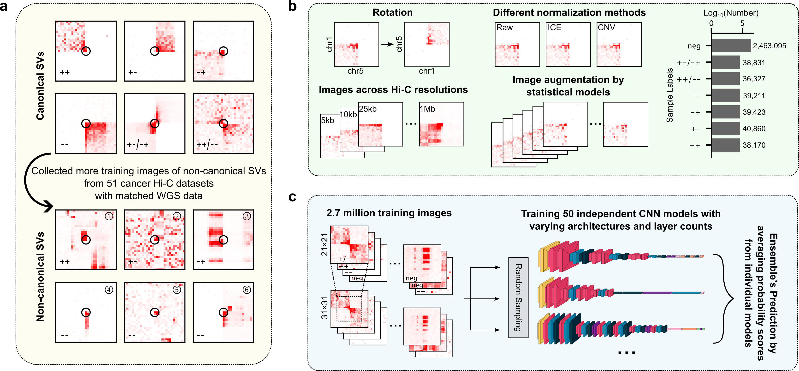

EagleC2
*******
Hi-C has emerged as a powerful tool for detecting structural variations (SVs), but its
sensitivity remains limited—particularly for SVs lacking canonical contact patterns. Here,
we introduce EagleC2, a next-generation deep-learning framework that integrates an ensemble
of convolutional neural networks (CNNs) with diverse architectures, trained on over 2.7
million image patches from 51 cancer Hi-C datasets with matched whole-genome sequencing
(WGS) data. EagleC2 substantially outperforms its predecessor (EagleC) and other state-of-the-art
methods, achieving consistently higher precision and recall across diverse validation datasets.
Notably, it enables the discovery of non-canonical SVs—including complex rearrangements and
fusions involving extremely small fragments—that are frequently missed by existing tools. In
individual cancer genomes, EagleC2 detects over a thousand previously unrecognized SVs, the
majority of which are supported by orthogonal evidence. To support clinical and diagnostic
applications, EagleC2 also offers a rapid evaluation mode for accurately screening predefined
SV lists, even at ultra-low coverage (e.g., 1× depth). When applied to single-cell Hi-C data
from glioblastoma before and after erlotinib treatment, EagleC2 reveals extensive SV heterogeneity
and dynamic structural changes, including events overlooked by conventional pipelines. These
findings establish EagleC2 as a powerful and versatile framework for SV discovery, with broad
applications in genome research, cancer biology, diagnostics, and therapeutic development.

Unique features of EagleC2
==========================
Compared with the original EagleC, EagleC2 has the following unique features:

- EagleC2 is able to detect non-canonical SVs, including fine-scale complex rearrangements
  (multiple SVs clustered within a local window) and fusions involving extremely small fragments
- EagleC2 offers a rapid evaluation mode for accurately screening predefined SV lists,
  even at ultra-low coverage (e.g., 1× depth)
- EagleC2 supports arbitrary resolutions, without requiring model re-training for each resolution
- EagleC2 enables fast genome-wide SV prediction on large Hi-C datasets without the need for
  distributed computing across multiple nodes
- EagleC2 supports both CPU and GPU inference

Navigation
==========
- `Installation`_
- `Download pre-trained models`_
- `Overview of the commands`_
- `Quick start`_
- `Visualize local contact patterns around SV breakpoints`_
- `Post-processing and filtering of SV predictions`_
- `Evaluation of predefined SVs`_

Installation
============
EagleC2 and all required dependencies can be installed using `mamba <https://github.com/conda-forge/miniforge>`_
and `pip <https://pypi.org/project/pip/>`_.

After you have installed *mamba* successfully, you can create a conda environment
for EagleC2 by executing the following commands (for Linux users)::

    $ conda config --add channels defaults
    $ conda config --add channels bioconda
    $ conda config --add channels conda-forge
    $ mamba create -n EagleC2 cooler hdbscan scikit-learn numba statsmodels "tensorflow>=2.16" "joblib=1.3"
    $ mamba activate EagleC2
    $ pip install eaglec

This will intall the core dependencies required to run EagleC2.

If you also wish to use the visualization module, please install the following
additional packages::

    $ mamba install matplotlib pyBigWig

If you plan to use the gene fusion annotation module, please install::

    $ mamba install pyensembl

For macOS users (tested on Apple M-series chips only), you can install EagleC2
and its dependencies with::

    $ conda config --add channels defaults
    $ conda config --add channels bioconda
    $ conda config --add channels conda-forge
    $ mamba create -n EagleC2gpu python=3.11 hdbscan joblib=1.3 scikit-learn numba statsmodels
    $ mamba activate EagleC2gpu
    $ pip install cooler
    $ pip install "tensorflow>=2.16"
    $ pip install tensorflow-metal
    $ pip install eaglec

Similarly, if you would like to use the visualization or gene fusion annotation modules
on macOS, please install *matplotlib*, *pyBigWig*, and *pyensembl* as described above.

Download pre-trained models
===========================
Before proceeding, please download the pre-trained `models <https://www.jianguoyun.com/p/DWhJeUsQh9qdDBjVpoEGIAA>`_ for EagleC2.

Unlike EagleC, which relied on separate models trained for specific resolutions
(e.g., 5 kb, 10 kb, 50 kb, and 500 kb) and sequencing depths, EagleC2 was trained
on a unified dataset that integrates samples across a wide range of resolutions
and depths. This allows for seamless application to data at arbitrary resolutions
and sequencing depths, without the need for model re-training.

Overview of the commands
========================
EagleC2 is distributed with eight command-line tools. You can ``command [-h]`` in a
terminal window to view the basic usage of each command.

- predictSV

  *predictSV* is the core command for predicting SVs from chromatin contact maps.

  Required inputs:

  1. Path to a .mcool file – This is a multi-resolution format for storing contact
     matrices. See `cooler <https://github.com/open2c/cooler>`_ for details. If you only have
     .hic files (see `Juicer <https://github.com/aidenlab/juicer>`_), you can convert them
     to .mcool using `hic2cool <https://github.com/4dn-dcic/hic2cool>`_ or `HiClift <https://github.com/XiaoTaoWang/HiCLift>`_.
  2. Path to the folder containing the pre-trained models.
  
  Output:

  The predicted SVs will be written to a .txt file with 13 columns:

  - Breakpoint coordinates (chrom1, pos1, chrom2, pos2)
  - Probability values for each SV type (++, +-, -+, --, ++/--, and +-/-+)
  - The resolution of the contact matrix from which the SV was originally predicted
  - The finest resolution to which the SV can be refined
  - The number of bad bins near the SV breakpoints

- plot-SVbreaks

  Plots a local contact map centered on the provided SV breakpoint coordinates. For
  intra-chromosomal SVs, contact counts will be distance-normalized. All contact matrices will
  be min-max scaled to the range [0, 1].

  The input breakpoint coordinates should follow the format: "chrom1,pos1,chrom2,pos2".

  This is useful for visually checking whether the expected contact patterns are present
  around SV breakpoints, including those identified by short-read or long-read whole-genome
  sequencing methods.

- filterSV

  Filters the predicted SVs based on ...

- evaluateSV

  Evaluates a predefined list of SVs using EagleC2 models ...

- reformatSV

  Reformats the output from *predictSV* into a format compatible with `NeoLoopFinder <https://github.com/XiaoTaoWang/NeoLoopFinder>`_.
  
- annotate-gene-fusion

  Annotates gene fusion events for a list of SV breakpoints.

- plot-interSVs

  Plots a contact map for a specified set of chromosomes, with predicted SVs marked.

- plot-intraSVs

  Plots a contact map for a specified genomic region, with predicted SVs marked.

As the commands *annotate-gene-fusion*, *plot-interSVs*, and *plot-intraSVs* are directly
inherited from the original EagleC, this documentation does not cover them in detail. For
more information, please refer to the orignal `EagleC documentation <https://github.com/XiaoTaoWang/EagleC>`_

Quick Start
===========
The following steps will guide you through the process of using EagleC2. And all
commands below are expected to be executed in a terminal window.

First, place the downloaded pre-trained models in your working directory and unzip it::
    
    $ unzip EagleC2-models.zip

Next, let's download a test dataset `FY1199.used_for_SVpredict.mcool <https://www.jianguoyun.com/p/DYoL0UgQh9qdDBjdpoEGIAA>`_
(~18 million contact pairs) in FY1199, a human lymphoblastoid cell line which has a
balanced known inter-chromosomal translocation between chromosomes 11 and 22
(46,XY,t(11;22)(q23.3;q11.2)). Place it under the same directory as the pre-trained
models.

To predict SVs from this Hi-C data, just execute the following command::

    $ predictSV --mcool FY1199.used_for_SVpredict.mcool --resolutions 25000,50000,100000 \
                --high-res 25000 --prob-cutoff-1 0.5 --prob-cutoff-2 0.5 -O FY1199_EagleC2 \
                -g hg38 --balance-type ICE -p 8 --intra-extend-size 1,1,1 --inter-extend-size 1,1,1

Again, typing ``predictSV -h`` in a terminal window will show you the description
of each parameter. Basically, the above command will perform a genome-wide SV
prediction on ICE-normalized (determined by the parameter ``--balance-type``) contact
matrices at 50kb and 100kb resolutions (the resolutions specified by ``--resolutions``
excluding the resolutions specified by ``--high-res``). To speed up the calculation,
pixels with significantly higher contact counts will be identified and extended by 1
bin at both ends (specified by ``--intra-extend-size`` and ``--inter-extend-size``,
the bin numbers specified by these two parameters correspond to each of the resolution
specified by ``--resolutions``) to cover potential SV breakpoints. SV predictions
made at coarser resolutions will be refined by progressively searching for more precise
breakpoint coordinates at higher resolutions. For example, here an SV initially predicted
at 100kb (with a probability cutoff of 0.5, determined by the parameter ``--prob-cutoff-1``)
will be refined by searching for corresponding breakpoints at 50kb. If the probability
at 50kb exceeds the cutoff of 0.5 (determined by the parameter ``--prob-cutoff-2``),
the SV will be further refined at 25kb. Otherwise, it stops and reports the coordinates
at 50kb as the final prediction. Finally, SV predictions across all resolutions are merged
in a non-redundant manner. Note that for resolutions specified by ``--high-res``, the
program will not perform a genome-wide search, but will only detect short-range SVs
and refine SV calls identified at coarser resolutions.

The I/O, preprocessing, and postprocessing steps will be performed in parallel with 8
CPU cores (specified by ``-p 8``). If GPU is available and if the flag ``--cpu`` is
not set, the model inference will be performed on the GPU.

Wait for ~5 minutes (this may vary depending on your machine), you will find the predicted
SVs in a .txt file named as "FY1199_EagleC2.SV_calls.txt" in your current working directory::

    $ cat FY1199_EagleC2.SV_calls.txt

    chrom1	pos1	chrom2	pos2	++	+-	-+	--	++/--	+-/-+	original resolution	fine-mapped resolution	gap info
    chr4	52200000	chr4	64400000	0.6095	1.42e-06	1.96e-06	7.996e-09	3.169e-08	9.618e-09	100000	100000	0,0
    chr11	116800000	chr22	20300000	2.495e-11	1.013e-06	5.552e-07	7.897e-11	2.943e-12	1	50000	25000	0,0

Note the known balanced translocation has been successfully detected. The final breakpoint
coordinates (chr11:116800000;chr22:20300000) for this SV are reported at 25kb resolution
(based on the column "fine-mapped resolution"), and this SV is originally predicted
at 50kb resolution (based on the column "original resolution"). The last column "gap info"
indicates that there are no bad bins (bins with extremely low contact counts) near either
of the breakpoints (0,0).

.. note:: Options for the ``--balance-type`` parameter includes "ICE", "CNV" and "Raw".
    By specifying "--balance-type Raw", the raw contact matrices will be used. Otherwise,
    if you choose CNV, CNV-normalized contact matrices will be used, and in this case,
    please make sure you have run "correct-cnv" of the `NeoLoopFinder <https://github.com/XiaoTaoWang/NeoLoopFinder>`_
    toolkit before you run *predictSV*; if you choose ICE, make sure you have run
    "cooler balance" on your Hi-C matrices before you run this command. Different normalization
    methods usually lead to overall similar but not identical SV predictions. If you want to
    achieve the best sensitivity, we recommend you to run *predictSV* on all three types of
    contact matrices (Raw, CNV, and ICE) and then merge the results together.

Visualize local contact patterns around SV breakpoints
======================================================

Post-processing and filtering of SV predictions
===============================================

Evaluation of predefined SVs
============================